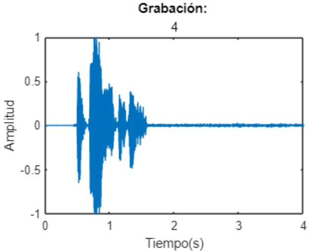
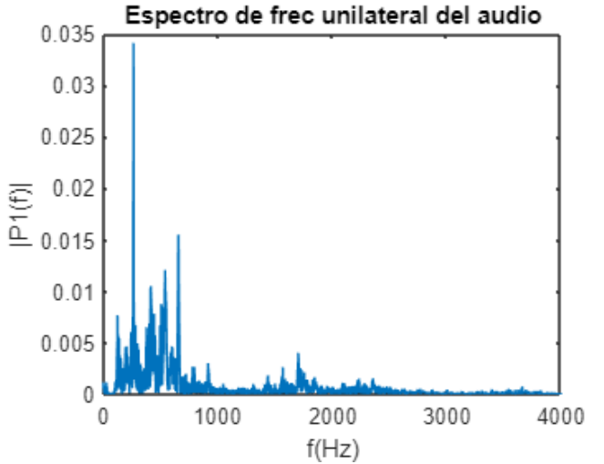
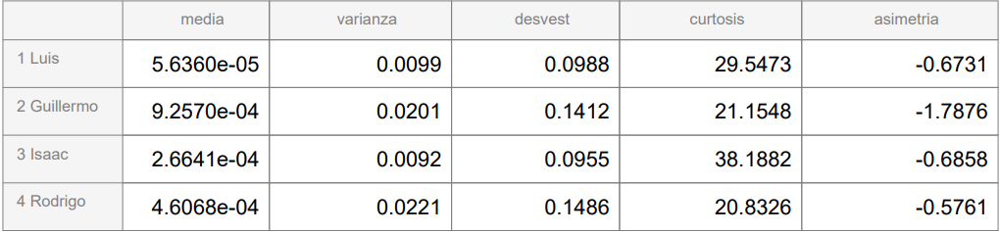
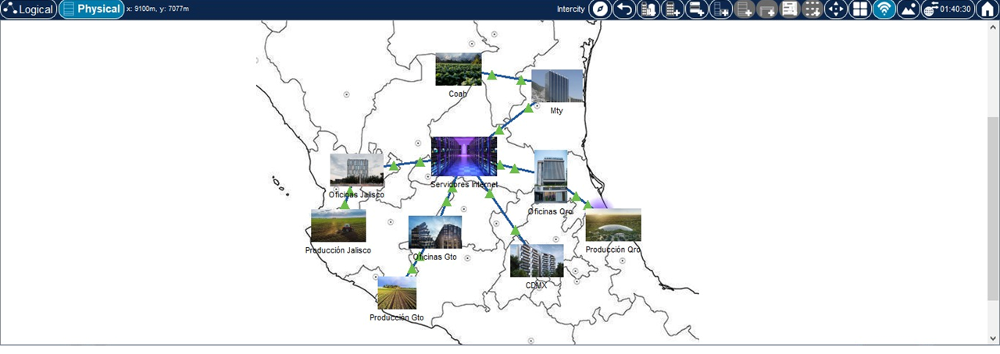
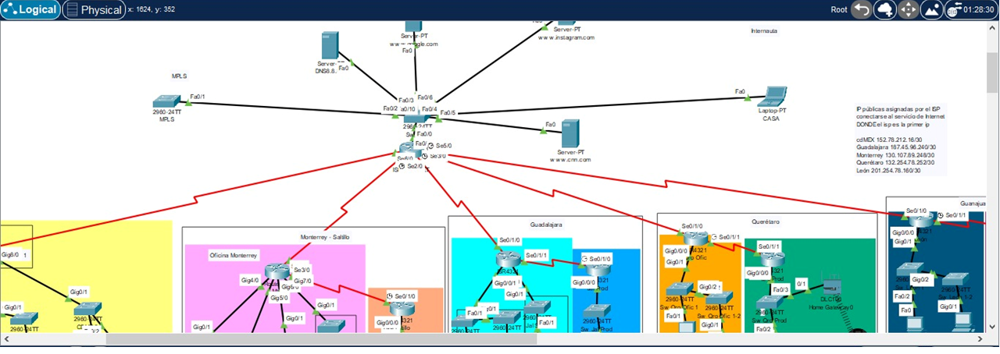

## Career Portfolio

### About Me
My name is Rodrigo García Estrada
I am currently studying the sixth semester on Robotics and Digital Systems, at Instituto Tecnológico y Estudios Superiores de Monterrey, on Mexico. I like programming and using hardware, and I have developed skills in different programming languages for different purposes.
Some projects that have helped me develop these are:

1. **Design of a Biometric System for Voice Signals Processing**
2. **Intelligent Platform for Air Pressure Prototype on Agricultural Equiment**
3. **Growth of a Corporate Network**
4. **Cyber-Physic Videogame using an FPGA**

### Design of a Biometric System for Voice Signals Processing
The goal of this project was to identify different voices using mathematical and statistical functions. This code was done using MATLAB, and allowed users to record their voices and analyze them. The most important function was the Fourier Fourier Transform, to find the most present frequencies. Then, we used statistical analysis to find the differences between the voice recordings, and display graphs and tables.

<table style="width:100%">
<tr>
<td>

</a>
</td>
<td>
</a>
</td>
<td>

</a>
</td>
</tr>
<tr>
<td>
Voice recording's decibels amplitud
</a>
</td>
<td>
Frecuency analysis 
</a>
</td>
<td>
Table for statistical analisis
</a>
</td>
</tr>
</table>

___

### Intelligent Platform for Air Pressure Prototype on Agricultural Equiment
The main goal of this project, which we worked on with John Derre, was to implement a controller to allow a bag to inflate or deflate depending on the internal pressure of it, which represented a tire. Using a closed-loop controller, we read the data from the a pressure sensor to determine the internal pressure of the bag, while an air pump and a solenoid valve were turned on and off to let the air flow to or from the bag. We used an STM32 microcontroller to apply the control, including the sensor and the actuators, as well as the LCD display and the CAN, SPI and L2C communication.

Along with this, we also created a digital interface using Arduino Cloud, to view the pressure and determine de desired one. Finally, we used an extra sensor to read the movement of our plant. With this, we used the Fast Fourier Transform to analyze the frequency of the vibrations. 

<table style="width:100%">
<tr>
<td>

</a>
</td>
<td>

</a>
</td>
<td>

</a>
</td>
</tr>
<tr>
<td>
Control Diagram
</a>
</td>
<td>
Vibration Analisis
</a>
</td>
<td>
Esquematic
</a>
</td>
</tr>
<tr>
<td>

</a>
</td>
<td>

</a>
</td>
</tr>
<tr>
<td>
Presented Plant
</a>
</td>
<td>
LCD display
</a>
</td>
</tr>
</table>

Arduino Cloud interface

___

### Growth of a Corporate Network

We used Packet Tracer from Cisco to create a Network of connectivity Devices that represetented a LAN and WAN Network from an Enterprise. We did a Logical and Physical disign, which helped us show how it should be connected in areas or Topologies, and how it would look when done physically. For this, we were given the characteristics of the Enterprise, and with this we could make the calculations to find how many Routers, Switches and Terminal Devices we would need for a given growth. We had to make and IP subdivision and network mask following the protocols given, so we could program these devices to connect with each other depending on the region of the country, and gave them security, names and IP address.

Physical View

Logical View

___

### Cyber-Physic Videogame using an FPGA

Working with Intel, we programmed a videogame controlled via an FPGA and displayed on two different screens. We used a button and an accelerometer from the FPGA, so that we implemented UART communication, and VGA for the screens. This was the first time using VHDL and Processing, as well as the first project to do after virtual classes due to pandemic.

<table style="width:100%">
<tr>
<td>

</a>
</td>
<td>

</a>
</td>
</tr>
<tr>
<td>
FPGA as a controller
</a>
</td>
<td>
Result displayed at screens
</a>
</td>
</tr>
</table>

